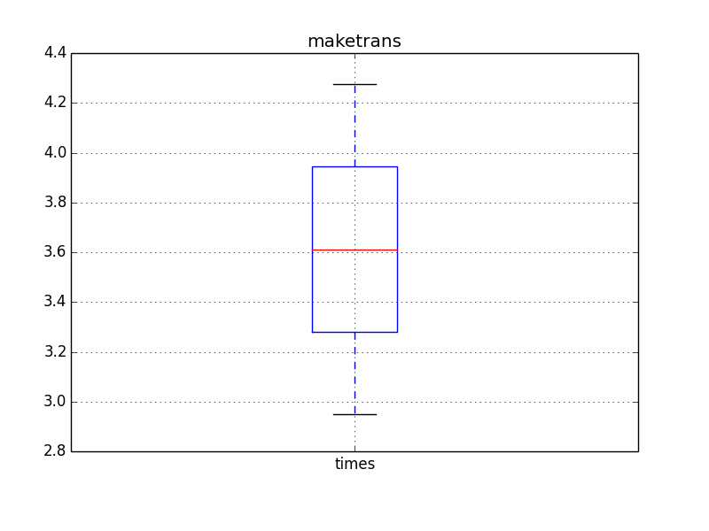

DNA reverse complement challenge
==================================

Goals
======

- read a fasta file (see below link to GRCh38)
- perform reverse complement
- save result in a fasta file

Template
==========

The code should provide:

- a class called **DNAReverseComplement**
- a method called **run** that does the reading/writing/complement

So you should end up with something like::

    class DNAReverseComplement(object):
        def __init__(self):
            pass

        def run(self, filename="Homo_sapiens.GRCh38.dna.chromosome.10.fa", output='out.fa'):
            pass

Input sequence
=================

To retrieve the sequence to play with, type::

    wget ftp://ftp.ensembl.org/pub/release-77/fasta/homo_sapiens/dna/Homo_sapiens.GRCh38.dna.chromosome.10.fa.gz 

Testing
=============

Edit update_lb.py to add your module's name and execute the script to check where you stand.

Current status
================

    Current leaderboard

